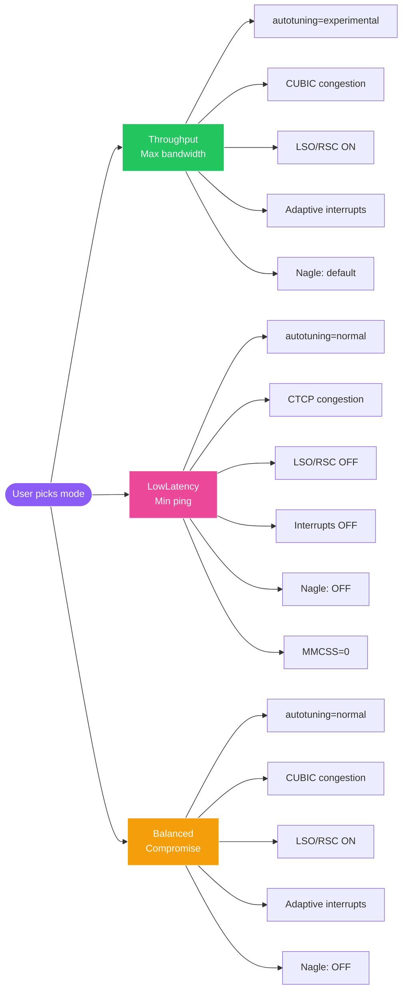
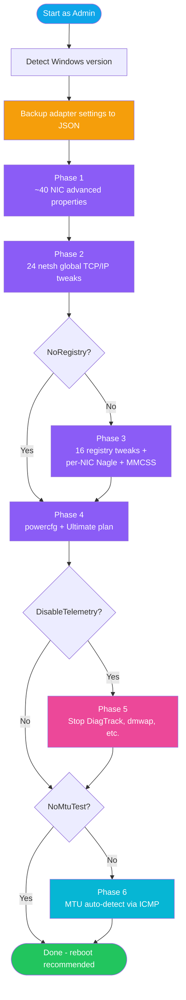

<!-- ============================================================ -->
<!-- ANIMATED HEADER (capsule-render.vercel.app)                  -->
<!-- ============================================================ -->
<p align="center">
  
</p>

<!-- ============================================================ -->
<!-- TYPING ANIMATION (readme-typing-svg.demolab.com)             -->
<!-- ============================================================ -->
<p align="center">
  <a href="https://github.com/Rezurmas/windows-network-optimizer">
    
  </a>
</p>

<!-- ============================================================ -->
<!-- BADGES (shields.io - animated colors)                        -->
<!-- ============================================================ -->
<p align="center">
  <a href="https://github.com/Rezurmas/windows-network-optimizer/releases"></a>
  <a href="LICENSE"></a>
  
  
</p>

<p align="center">
  <a href="https://github.com/Rezurmas/windows-network-optimizer/stargazers"></a>
  <a href="https://github.com/Rezurmas/windows-network-optimizer/issues"></a>
  <a href="https://github.com/Rezurmas/windows-network-optimizer/network/members"></a>
  
  
  
</p>

<!-- ============================================================ -->
<!-- ANIMATED DIVIDER                                             -->
<!-- ============================================================ -->
<p align="center">
  
</p>

## What is this?

A **single PowerShell script** that applies ~100 network optimizations to Windows in 30 seconds:

```powershell
.\Optimize-NetworkAdapter.ps1
# Pick a mode -> pick a DNS -> reboot -> done.
```

It tunes your network card, TCP/IP stack, registry, MMCSS scheduler, power management,
and lets you swap DNS to one of **21 built-in providers** (Cloudflare, Quad9, AdGuard,
DNS4EU, Mullvad, AliDNS for China, etc.) - all interactive, with rollback support.

> No bloat. No installer. No telemetry of its own. Just one `.ps1` and a `.bat` launcher.

<p align="right">
  
  
  
</p>

---

## Features

<table>
<tr>
<td width="50%">

### Performance
- **40+ NIC settings** auto-tuned (offloads, buffers, EEE off)
- **24 TCP/IP global tweaks** via `netsh` (autotuning, RSS, ECN, HyStart, PRR)
- **16 registry TCP/IP performance values** (Tcp1323Opts, MaxUserPort, SACK, ...)
- **MMCSS gaming priority** (NetworkThrottlingIndex disable, Games task boost)
- **Per-interface Nagle OFF** for gaming (TcpAckFrequency=1, TCPNoDelay=1)
- **Powercfg deep tweaks** (USB Suspend OFF, PCIe LSPM OFF, CPU 100%)
- **Ultimate Performance** power plan auto-enabled

</td>
<td width="50%">

### Privacy & Convenience
- **DNS chooser** - 21 providers, interactive menu with category icons
- **Telemetry off** (opt-in) - DiagTrack, Delivery Optimization, dmwap
- **MTU auto-detection** via ICMP fragmentation test (binary search)
- **Backup & rollback** - JSON snapshots, one command to restore
- **Three modes** - `Throughput` / `LowLatency` / `Balanced`
- **Silent mode** for CI/automation pipelines
- **Multi-language detection** - English + Polish NIC display names supported

</td>
</tr>
</table>

---

## Quick Start

<table>
<tr><td>

### Option 1 - Easy (.bat launcher)

```batch
:: Right-click -> Run as administrator
Run-NIC-Optimizer.bat
```

Auto-elevates via UAC and shows a 7-option menu.

</td><td>

### Option 2 - PowerShell

```powershell
# Run as Administrator
.\Optimize-NetworkAdapter.ps1
```

Interactive: pick adapter -> pick DNS -> done.

</td></tr>
</table>

### Option 3 - One-liner from GitHub

```powershell
# Run as Administrator (downloads & runs latest release)
iwr "https://raw.githubusercontent.com/Rezurmas/windows-network-optimizer/main/Optimize-NetworkAdapter.ps1" -OutFile $env:TEMP\opt.ps1
& $env:TEMP\opt.ps1
```

---

## CLI Examples

```powershell
# Max bandwidth for ALL Ethernet adapters
.\Optimize-NetworkAdapter.ps1 -Mode Throughput -All

# Gaming low-latency + Cloudflare DNS
.\Optimize-NetworkAdapter.ps1 -Mode LowLatency -DnsProvider 1

# Full automation (CI/CD, no prompts)
.\Optimize-NetworkAdapter.ps1 -Mode Throughput -All -DnsProvider 11 -DisableTelemetry -Silent

# Custom DNS (your own IPs)
.\Optimize-NetworkAdapter.ps1 -DnsProvider "1.1.1.1,9.9.9.9"

# Adapter only (skip registry / MMCSS / power)
.\Optimize-NetworkAdapter.ps1 -NoRegistry

# Skip MTU test (saves ~30s)
.\Optimize-NetworkAdapter.ps1 -NoMtuTest

# Rollback latest changes from JSON backup
.\Optimize-NetworkAdapter.ps1 -Restore
```

---

## Mode Comparison



| Setting               | Throughput      | LowLatency       | Balanced          |
|-----------------------|-----------------|------------------|-------------------|
| TCP autotuning        | `experimental`  | `normal`         | `normal`          |
| Congestion provider   | `cubic`         | `ctcp`           | `cubic`           |
| LSO/RSC offload       | ON              | **OFF**          | ON                |
| Interrupt Moderation  | Adaptive        | OFF              | Adaptive          |
| Nagle's algorithm     | default         | **OFF**          | **OFF**           |
| MMCSS Responsiveness  | 10              | **0**            | 10                |
| Best for              | Streaming, DL   | CS2, Valorant    | Daily mixed use   |

---

## DNS Providers (21 built-in)

<details>
<summary><b>Click to expand the full DNS table</b></summary>

| ID | Category   | Provider                     | Primary IPs                  | What it does |
|----|------------|------------------------------|------------------------------|--------------|
| 1  | Speed      | **Cloudflare**               | `1.1.1.1` `1.0.0.1`          | Fastest globally per DNSPerf, no logs |
| 2  | Speed      | Google Public DNS            | `8.8.8.8` `8.8.4.4`          | Stable, ECS support, large anycast |
| 3  | Speed      | Quad9 Unsecured              | `9.9.9.10`                   | Quad9 without filter |
| 4  | Speed      | OpenDNS Home                 | `208.67.222.222`             | Cisco, basic phishing block |
| 5  | Security   | Cloudflare Malware           | `1.1.1.2` `1.0.0.2`          | Cloudflare + malware blocklist |
| 6  | Security   | **Quad9 Secure (recommend.)** | `9.9.9.9`                    | Swiss, no-log, DNSSEC, malware block |
| 7  | Security   | CleanBrowsing Security       | `185.228.168.9`              | Security filter |
| 8  | Family     | Cloudflare Family            | `1.1.1.3` `1.0.0.3`          | + adult content block |
| 9  | Family     | OpenDNS FamilyShield         | `208.67.222.123`             | Auto adult-block |
| 10 | Family     | CleanBrowsing Family         | `185.228.168.168`            | Family + adult + malware filter |
| 11 | AdBlock    | **AdGuard DNS** (default)    | `94.140.14.14` `94.140.15.15`| Blocks ads + trackers |
| 12 | AdBlock    | AdGuard Family               | `94.140.14.15` `94.140.15.16`| AdGuard + adult block |
| 13 | AdBlock    | ControlD Free                | `76.76.2.0`                  | Customizable adblock |
| 14 | AdBlock    | Mullvad AdBlock              | `194.242.2.3`                | Privacy + adblock |
| 15 | Privacy    | AdGuard Unfiltered           | `94.140.14.140`              | No log, no filter |
| 16 | Privacy    | Mullvad DNS                  | `194.242.2.2`                | Sweden, RAM-only, max privacy |
| 17 | EU         | **DNS4EU Protective**        | `86.54.11.1`                 | EU-funded (2025), GDPR, malware filter |
| 18 | EU         | DNS4EU Unfiltered            | `86.54.11.100`               | DNS4EU no-filter |
| 19 | EU         | DNS4EU Child Protect         | `86.54.11.13`                | EU + child protection |
| 20 | China      | AliDNS (Alibaba)             | `223.5.5.5` `223.6.6.6`      | Fastest in mainland China |
| 21 | China      | DNSPod (Tencent)             | `119.29.29.29`               | Tencent, supports SM2 crypto |
| 99 | Reset      | Reset to DHCP                | (router)                     | Use this if you have Pi-hole/AdGuard Home |

</details>

> **Tip:** Have AdBlock on your router (Pi-hole, AdGuard Home, OpenWrt)? Pick **`Skip`** in the menu instead of overriding it.

---

## Console Output

The script uses **7 distinct color-coded message types** for instant scanning:

```
[ OK ]  green     - operation succeeded
[ +> ]  cyan      - applying a change (before -> after)
[ !! ]  yellow    - non-critical warning
[ XX ]  red       - critical error
[ .. ]  gray      - informational
[ -- ]  dark gray - skipped (already optimal or unsupported)
[ ?? ]  magenta   - tip / suggestion for user
```

The startup banner is **mode-aware** - color changes based on whether you picked
Throughput (green), LowLatency (magenta), or Balanced (yellow).

---

## Compatibility

| OS                              | Status      | Notes                              |
|---------------------------------|-------------|------------------------------------|
| Windows 11 (any build)          | ✅ Full      | Native PowerShell cmdlets          |
| Windows 10 (any build)          | ✅ Full      | Native PowerShell cmdlets          |
| Windows 8.1                     | ✅ Full      | `Get-NetAdapter` works             |
| Windows 8 / Server 2012         | ⚠ Partial   | Uses `netsh` fallback              |
| Windows 7 SP1                   | ⚠ Partial   | DNS via netsh, limited NIC API     |
| Windows Server 2012 R2 / later  | ✅ Full      | All features supported             |
| PowerShell 5.0+                 | ✅           | Default on Win 10+                 |
| PowerShell 7.x                  | ✅           | Cross-edition compatible           |
| x86 / x64                       | ✅           | Auto-detected at runtime           |

---

## How It Works



---

## Rollback

The script auto-creates a JSON backup of all adapter settings BEFORE any change.
Restore at any time:

```powershell
.\Optimize-NetworkAdapter.ps1 -Restore
```

Backups are stored at: `%USERPROFILE%\Desktop\NIC-Backup\<adapter>--<timestamp>.json`

---

## Warnings

- ⚠ **Reboot required** after first run (registry + TCP global tweaks need reboot)
- ⚠ **VPN clients** with Layered Service Providers may need reconnection after reboot
- ⚠ **AdBlock router users** - pick `Skip` in DNS menu, don't override your router DNS
- ⚠ The script **intentionally skips** `netsh winsock reset` (can break VPN/AV with LSPs).
  Run it manually only if you have specific connection issues.
- ⚠ MTU test sends ICMP packets - may show warnings if your firewall blocks them

---

## Project Structure

```
windows-network-optimizer/
├── Optimize-NetworkAdapter.ps1   # Main script (1454 lines, ~50 functions)
├── Run-NIC-Optimizer.bat         # One-click launcher with UAC auto-elevation
├── README.md                     # This file
├── LICENSE                       # MIT
└── .gitignore                    # Excludes NIC-Backup/, private files, IDE configs
```

---

## Sources & Credits

Research and tweaks compiled from:

- **Microsoft Learn** - official `netsh` and TCP/IP documentation
- **Reddit** - r/pcmasterrace, r/dns, r/networking, r/PowerShell
- **Atlas-OS** - open-source Windows performance modification project
- **ChrisTitusTech/winutil** - Windows debloat & utility script
- **DNSPerf** - DNS performance benchmarks (2025)
- **guru3D Forums**, **BlurBusters**, **Windows Forum**
- **DNS4EU project** - European Union public DNS resolver (launched June 2025)
- **CSDN, blog.csdn.net** - Chinese tech blogs for AliDNS / DNSPod info

---

## Contributing

PRs welcome! Areas where help is appreciated:

- Additional NIC vendor advanced property regex patterns
- New DNS providers worth adding to the default list
- Translations to other languages (currently EN + PL display names supported)
- Windows Server-specific tweaks
- Hardware testing (Intel I225/I226, Realtek 2.5G, Killer NICs, etc.)
- Better Mermaid diagrams / GIF demos

Steps:

1. Fork the repo
2. Create a branch (`git checkout -b feature/my-tweak`)
3. Test locally on real hardware
4. Open a PR with a clear description of what changed and why

---

## License

[MIT](LICENSE) - free for personal and commercial use, no warranty.

---

<!-- ============================================================ -->
<!-- ANIMATED FOOTER (capsule-render)                             -->
<!-- ============================================================ -->
<p align="center">
  
</p>

<p align="center">
  <a href="https://github.com/Rezurmas/windows-network-optimizer/stargazers">
    
  </a>
  &nbsp;•&nbsp;
  <a href="https://github.com/Rezurmas/windows-network-optimizer/issues/new">
    Report a bug
  </a>
  &nbsp;•&nbsp;
  <a href="https://github.com/Rezurmas/windows-network-optimizer/issues/new">
    Request a feature
  </a>
</p>
